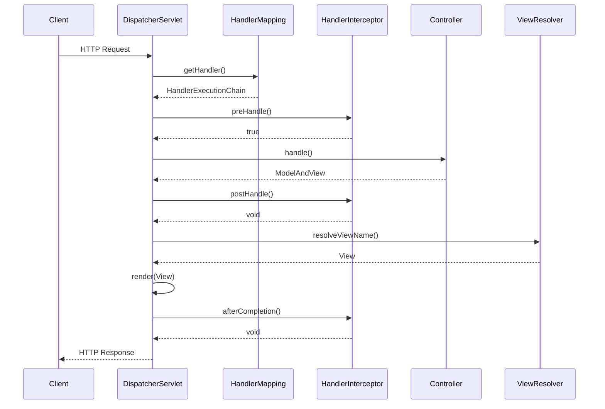

# Development

## 前提

Spring FrameworkとLog4j2を使用して、コントローラー、サービス、DAOの各層でログを出力する実装例。

## 要項

- LogUtilクラスを使用して、構造化ログを実現しています。
- RequestContextを使用して、アクセスIDとエンドポイントURLをリクエストスコープで管理しています。
- LoggingInterceptorで、各リクエストに対してユニークなアクセスIDを生成し、エンドポイントURLを記録しています。
- 各層（コントローラー、サービス、DAO）で、LogUtilを使用してログを出力しています。
- Log4j2の設定で、ThreadContextに格納された追加情報をログに出力するようにしています。

この実装により、リクエスト全体を通じて一貫したログ出力が可能となり、トレーサビリティが向上します。また、構造化ログにより、ログの解析が容易になります。
実際の運用では、この基本的な実装にさらなる機能（例：非同期処理のコンテキスト伝播、動的ログレベル変更、セキュリティフィルターなど）を追加することで、より堅牢なログシステムを構築できます。

## ディレクトリ想定

```text
src/
├── main/
│   ├── java/
│   │   └── com/
│   │       └── example/
│   │           └── myapp/
│   │               ├── MyAppApplication.java
│   │               ├── config/
│   │               │   └── WebConfig.java
│   │               ├── controller/
│   │               │   └── UserController.java
│   │               ├── service/
│   │               │   └── UserService.java
│   │               ├── dao/
│   │               │   └── UserDao.java
│   │               ├── model/
│   │               │   └── User.java
│   │               ├── interceptor/
│   │               │   └── LoggingInterceptor.java
│   │               └── util/
│   │                   ├── LogUtil.java
│   │                   └── RequestContext.java
│   └── resources/
│       ├── application.properties
│       └── log4j2.xml
└── test/
    └── java/
        └── com/
            └── example/
                └── myapp/
                    └── (テストクラス)
```

## 技術要素

### HandlerInterceptor

[インターフェース HandlerInterceptor](https://spring.pleiades.io/spring-framework/docs/current/javadoc-api/org/springframework/web/servlet/HandlerInterceptor.html)  




RequestContext:

Spring Frameworkの一部です。
org.springframework.web.context.request パッケージに含まれています。
Web アプリケーションのリクエストスコープでデータを保持するのに使用されます。

HandlerInterceptor:

Spring MVCフレームワークの一部です。
org.springframework.web.servlet パッケージに含まれています。
HTTPリクエストの処理前後に追加のロジックを挿入するために使用されます。

MDC (Mapped Diagnostic Context):

MDC自体はSpring Frameworkの一部ではありません。SLF4J（Simple Logging Facade for Java）やLog4jなどのロギングフレームワークの機能です。
ただし、Spring BootはデフォルトでSLF4Jを使用しているため、Spring Bootプロジェクトで簡単に利用できます。